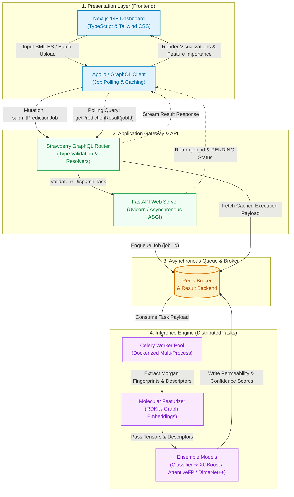

# Perm-Predict

[](https://www.python.org/)
[](https://fastapi.tiangolo.com/)
[](https://strawberry.rocks/)
[](https://nextjs.org/)
[](https://docs.celeryq.dev/)
[](https://www.docker.com/)

A full-stack, distributed web platform for AI-driven prediction of chemical accumulation and drug permeability in bacterial pathogens. **Perm-Predict** ingests small-molecule chemical representations (SMILES) and executes multi-stage machine-learning inference pipelines to output compound accumulation scores, model confidence intervals, and chemical feature analyses.

---

## Overview

Perm-Predict implements a two-stage predictive machine learning architecture designed to evaluate compound permeability in bacterial systems:

1. **Stage 1 (Binary Classification):** Evaluates input molecules to filter out compounds exhibiting "near-zero" baseline accumulation.
2. **Stage 2 (Ensemble Regression):** Compounds passing the initial classification filter are processed through an ensemble regression pipeline (**XGBoost**, **AttentiveFP**, and **DimeNet++**) to predict quantitative permeability rates.

Molecules are dynamically featurized from raw SMILES into learned molecular graph embeddings, classical physicochemical descriptors, and Morgan fingerprints prior to model inference.

---

## System Architecture

The application is built on a decoupled, asynchronous microservice architecture to decouple compute-intensive deep-learning inference from the HTTP presentation and API routing layers.



### Directory Structure

```
perm-predict/
├── backend/                  # FastAPI + Strawberry GraphQL + Celery
│   ├── app/
│   │   ├── main.py           # FastAPI ASGI application & GraphQL router mount
│   │   ├── worker.py         # Celery task definitions & distributed worker entry
│   │   ├── schema.py         # Strawberry GraphQL types, queries, and mutations
│   │   ├── models.py         # Pydantic schemas & data validation models
│   │   ├── config.py         # Base settings & environment variable management
│   │   ├── ml_models/        # Serialized ML model artifacts (.pkl / torch weights)
│   │   └── utils/
│   │       ├── processing.py # SMILES validation & molecular feature extraction
│   │       ├── validation.py # Input schema checks & sanity filtering
│   │       └── logger.py     # Structured logging utilities
│   ├── tests/                # Pytest test suite (unit and integration tests)
│   ├── Dockerfile            # Container configuration for backend API and workers
│   └── requirements.txt      # Python dependencies
├── frontend/                 # Next.js 14+ App Router (TypeScript + Tailwind CSS)
│   ├── src/
│   │   ├── app/              # Next.js App Router pages and layouts
│   │   ├── components/       # Reusable React UI components (shadcn/ui + Tailwind)
│   │   └── lib/              # GraphQL client initialization and state helpers
│   ├── Dockerfile            # Container configuration for frontend service
│   └── package.json          # Node.js dependencies and scripts
└── docker-compose.yml        # Multi-container orchestration (API, Worker, Redis, Web)
```

---

## Component Breakdown

- **Frontend (Next.js / TypeScript / Tailwind CSS):**
  - Modern dashboard built on the Next.js App Router for interactive chemical input and result analysis.
  - Real-time polling via a typed GraphQL client to handle asynchronous task updates without freezing the user interface.
  - Visualizes molecular structures, descriptor distributions, and ensemble confidence metrics.

- **Backend & API Gateway (FastAPI / Strawberry GraphQL):**
  - Asynchronous ASGI web service routing schema queries and task-dispatch mutations.
  - Enforces strict type checking and validation on all incoming SMILES strings before scheduling compute tasks.

- **Distributed Compute Engine (Celery / Redis):**
  - Celery handles parallel task execution across dedicated worker containers.
  - Redis acts as the central message broker and low-latency result cache.
  - Models run in dedicated worker processes to ensure isolation between inference compute and API throughput.

---

## Quick Start

### 1. Run with Docker Compose (Recommended)

To build and spin up the complete microservice stack (Frontend, API Gateway, Celery Worker, and Redis):

```bash
# Clone the repository
git clone [https://github.com/your-username/perm-predict.git](https://github.com/your-username/perm-predict.git)
cd perm-predict

# Launch all containerized services
docker-compose up --build
```

Once running, access the services:

- **Web Application:** `http://localhost:3000`
- **Interactive GraphQL Playground:** `http://localhost:8000/graphql`
- **FastAPI Docs:** `http://localhost:8000/docs`

---

### 2. Manual Local Development

#### Prerequisites

- Python 3.10+
- Node.js 18+ & npm
- Redis server running locally on `localhost:6379`

#### Backend Setup

```bash
cd backend

# Create and activate virtual environment
python -m venv venv
source venv/bin/activate  # On Windows: venv\Scripts\activate

# Install dependencies
pip install -r requirements.txt

# Terminal 1: Start the FastAPI GraphQL server
uvicorn app.main:app --reload --port 8000

# Terminal 2: Start the Celery distributed worker
celery -A app.worker.celery_app worker --loglevel=info
```

#### Frontend Setup

```bash
cd frontend

# Install Node packages
npm install

# Start the Next.js development server
npm run dev
```

The frontend will run at `http://localhost:3000` and proxy GraphQL requests to `http://localhost:8000/graphql`.

---

## Configuration & Environment Variables

### Backend Configuration (`backend/.env`)

```ini
# Broker & Backend Settings
CELERY_BROKER_URL=redis://localhost:6379/0
CELERY_RESULT_BACKEND=redis://localhost:6379/0

# Model Paths
MODEL_CLASSIFIER_PATH=app/ml_models/classifier_model.pkl
MODEL_REGRESSOR_PATH=app/ml_models/regressor_model.pkl

# Application Settings
ENVIRONMENT=development
LOG_LEVEL=INFO
```

### Frontend Configuration (`frontend/.env.local`)

```ini
NEXT_PUBLIC_GRAPHQL_ENDPOINT=http://localhost:8000/graphql
```

---

## GraphQL API Reference

The backend exposes an interactive GraphQL endpoint at `/graphql`.

### Submit Prediction Job

```graphql
mutation SubmitPrediction {
  submitPredictionJob(
    jobInput: {
      smilesList: ["CC(=O)OC1=CC=CC=C1C(=O)O", "CN1C=NC2=C1C(=O)N(C(=O)N2C)C"]
      jobName: "candidate_screening_batch_01"
    }
  ) {
    jobId
    status
    createdAt
  }
}
```

### Query Prediction Status & Results

```graphql
query GetPredictionDetails($jobId: String!) {
  getPredictionResult(jobId: $jobId) {
    jobId
    status
    results {
      smiles
      isAccumulating
      permeabilityScore
      confidenceInterval {
        lowerBound
        upperBound
      }
      features {
        molecularWeight
        logP
        tpsa
        rotatableBonds
      }
    }
  }
}
```

---

## Testing & Quality Assurance

Run the test suite across unit models, feature processing, and API routes:

```bash
cd backend
pytest tests/ -v
```
